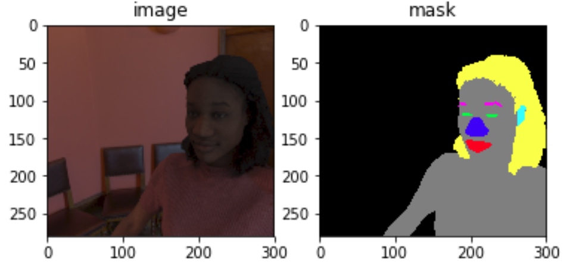
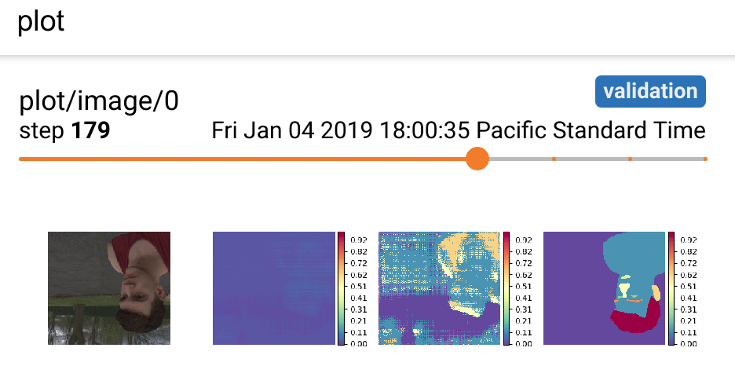
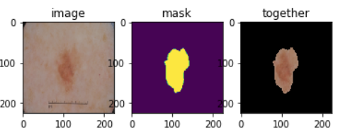
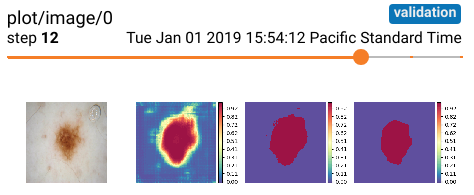
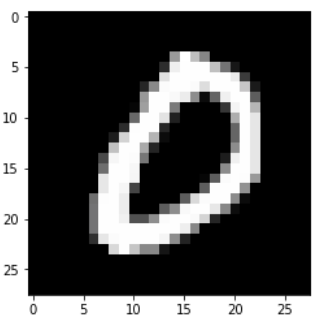
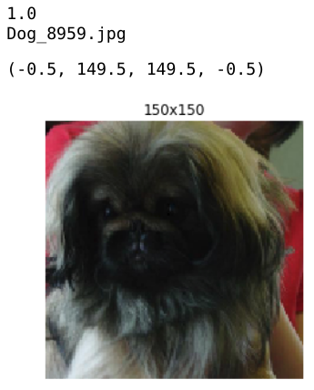
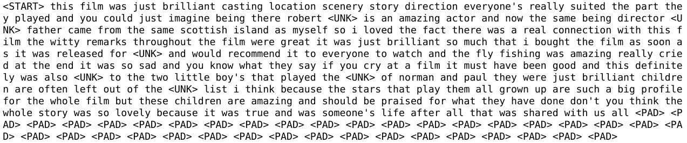
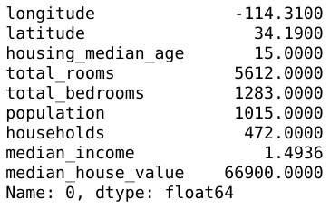

# YeahML

*This library is currently broken/outdated and in the process of migrating to tf2. The tf1 branch still supports the examples*

[//]: # (Image References)
[tensorboard_graph]: ./misc/tensorboard_graph.png
[tensorboard_scalar]: ./misc/tensorboard_scalar.png

<p align="center">

</p>

YeahML is a prototype framework for creating ML models ([D|R|C]NNs, primarily) using only, easy to understand, with sane defaults, configuration files (yaml or json).  Examples are currently being worked through and can be found in the [examples directory](./examples)

The core implementation is as follows:

1. Create `.tfrecords` for a training, validation, and test set
2. Write configuration files (json or yaml, see below)
  - for the main implementation (meta data, hyperparameters, etc)
  - for the hidden layers
3. Use python (as shown below) to train and evaluate the model
  - There are three main functions
    - build_graph
    - train_graph
    - evaluate_graph (will load the "best params" from training before evaluating)
4. Iterate on models and ideas
  - logs are created and can be used for debugging or evaluating models
  - tensorboard is ready to use
    - metric scalars
    - graph architecture
    - profiling
    - parameter histograms and distributions

## Main use

```python
import yeahml as yml

## parse config files
main_cdict, model_cdict = yml.create_configs(
    "./examples/cats_v_dogs_01/main_config.yaml"
)

## build graph
g = yml.build_graph(main_cdict, model_cdict)

## train graph
train_dict = yml.train_graph(g, main_cdict, model_cdict)
# train_dict contains metrics from training and validation

## evaluate graph
eval_dict = yml.eval_graph_from_saver(main_cdict)
# eval_dict contains metrics from the test set
```

Where documentation+examples for the main configuration file can be found [here](./docs/configuration_files/model_cdict.md) and documentation+examples for the main hidden layer architecture configuration file can be found [here](./docs/configuration_files/hidden_config.md). Additional information, such as documentation for the currently supported layer types [conv2d](./docs/configuration_files/layers/conv2d.md), [pooling](./docs/configuration_files/layers/pooling2d.md), and [dense](./docs/configuration_files/layers/dense.md) are also included.

## [Examples](./examples)

To help people get started, on a variety of different tasks, there are included examples in the [./examples](./examples) directory.  Each notebook contains a [`model_cdict`](./docs/configuration_files/model_cdict.md) file, a [`hidden_config`](./docs/configuration_files/hidden_config.md) file, and a directory called `make_records` that will create `.tfrecords`.

The current examples are:

- [**Multisegmentation (human faces)**](./examples/multi_segmentation)
<!-- <p align="left">

</p>
<p align="left">

</p> -->
- [**Segmentation (skin lesions)**](./examples/segmentation)
<!-- <p align="left">

</p>
<p align="left">

</p> -->
- [**Multiclass Image Classification (MNIST)**](./examples/mnist)
<!-- <p align="left">

</p> -->
- [**Binary Image Classification (Cats vs Dogs)**](./examples/cats_v_dogs)
<!-- <p align="left">

</p> -->
- [**Sentiment analysis (imdb movie reviews)**](./examples/sentiment_imdb)
<!-- <p align="left">

</p> -->
- [**Regression (california housing data)**](./examples/cali_housing)
<!-- <p align="left">

</p> -->

*Note: if you have another example you would like to see feel free to reach out to me or make a pull request.*


### Configuration Files

The model config may look similar to the following:

```yaml
overall:
  name: 'mnist'
  loss_fn: 'softmax'
  experiment_dir: 'trial_01'
  saver:
    save_params_name: "best_params_saver"
    load_params_path: "./examples/mnist/saved_params/best_params/best_params_ckpt.ckpt" # default location to load parameters from for transfer learning
  trace: 'full'
  logging:
    console:
      level: 'critical'
      format_str: null
    file:
      level: 'debug'
      format_str: null
    graph_spec: True
data:
  in:
    dim: [784]
    dtype: 'float32'
    reshape_to: [28, 28, 1]
  label:
    dim: [10]
    dtype: 'float32'
  TFR:
    dir: './examples/mnist/data/'
    train: 'train.tfrecords'
    validation: 'validation.tfrecords'
    test: 'test.tfrecords'
hyper_parameters:
  lr: 0.00001
  batch_size: 16
  epochs: 20
  optimizer: 'adam'
  default_activation: 'elu'
  shuffle_buffer: 128
  early_stopping:
    epochs: 3
    warm_up_epochs: 5
hidden:
  path: './examples/mnist/hidden_config.yaml'
#train:
  #image_standardize: True
  #augmentation:
    #aug_val: True
    #v_flip: True
    #h_flip: True
```

The hidden layer architecture config (where the path to this file is specified above by (`hidden:path`) may look similar to the following:

```yaml
layers:
  conv_1:
    type: 'conv2d'
    options:
      filters: 32
      kernel_size: 3
      strides: 1
      trainable: False # default is True
    saver:
      load_params: True # default is False
  conv_2:
    type: 'conv2d'
    options:
      filters: 64
      kernel_size: 3
      strides: 1
    saver:
      load_params: True
  pool_1:
    type: 'pooling2d'
  dense_1:
    type: 'dense'
    options:
      units: 16
      dropout: 0.5
    saver:
      load_params: True
```

### TensorBoard

After training, tensorboard can be used to inspect the graph and metrics by issuing the following command: `tensorboard --logdir "tf_logs/"` which will open tensorboard and display figures similar to those below.

![Example of TensorFlow graph in tensorboard -- showing the graph and compute time trace][tensorboard_graph]
Where the image on the left is of the specified graph (in the architecture config yaml file) and the graph on the right is showing a trace of compute time of the operations during training (set by the `overall:trace`) parameter in the model config file.

![Example of TensorFlow metrics in tensorboard -- showing scalars and histogram][tensorboard_scalar]

Where the image on the right shows the training and validation metrics during training (computed over the entire iteration) and the right shows histograms of the parameters (weights+biases) calculated during training.

### Logging

Logging, if enabled, will produce the following log files:

- `build.log`
  - Contains information about building the graph. [Information + Example](./docs/logs/build.md)
- `eval.log`
  - Contains information about evaluating the graph [Information + Example](./docs/logs/eval.md)
- `graph.log`
  - Contains human readable, basic, information about the graph [Information + Example](./docs/logs/graph.md)
- `preds.log`
  - Contains logs of each evaluation set (label, predicted, ground truth, confidence) [Information + Example](./docs/logs/preds.md)
- `train.log`
  - Contains information about training the graph [Information + Example](./docs/logs/train.md)

## Development

Main documentation is ongoing+work in progress. Please reach out if you have questions/concerns.

**If anyone would like to attempt to use or modify this project, feel free to open an issue and/or reach out to me on twitter [@Jack_Burdick](https://twitter.com/Jack_Burdick)**

## Known issues
- The latest version of TQDM will cause a "random" RuntimeError and stop training. Downgrading to a earlier version seems to resolve the issue. The issue may be related to this [GitHub issue](https://github.com/tqdm/tqdm/issues/613). I've been using version 4.19 as a fix:
```
conda install tqdm=4.19
```
- The output image for segmentation examples is hardcoded.

## Motivation

The primary motivation is to define and create (simple) models easily (for machines and humans). The *real* purpose for this framework, in addition to making developing/training models more easily, is to act as a helper for a separate project (TODO: include link once made) that will attempt to generate/analyze architectures.

### Future Goals

At the moment the project is being developed around a binary image classification task. In the future, I'd like to support:

1. Regression
2. Autoencoders
3. GANs

### TODO and in Progress

- move all examples to a new repository?
- package for conda/pip installation
- handle instance id when not present in the dataset (mnist) - include warning
- include 'WIPE' option to delete current logs as needed
- support additional metrics
- include documentation on what is possible (likely when the project is a little further along)
- don't wipe directories when running eval
- handle class imbalance (this is a bit loaded...)
- find way to simplify/standardize input type (beyond the current three tfrecords)
- find way to automate the reshaping of the label from the batch
- output preds csv (with format string) -- could be useful for competitions
- load params from specified paths for specified layers (beyond the default file)
  - this could be, potentially, useful for concatenation layer
- basic sanity check for building the parse/config file
- support type and name declarations from config for parsing tf records
- logging for initializing weights
- resource management/device placement
- config option for one_hot -- currently requires manual input
- An option for displaying sample outputs during training/evaluation
- allow prediction from regular values
  - not just tfrecords. This will also be important for serving implications
- Binary classification with the IMDB dataset
- Support `opts` for the optimizer
- Support different types of loss functions (right now these are hardcoded by (type)
- [sphinx](http://www.sphinx-doc.org/en/master/) documentation
- Add docstrings to each function
- Support for concatenation (would allow for the creation of custom modules -- similar to inception)
- Depthwise separable convolutions
- support k fold cross validation
- make config mapping dictionary read only [related SO](https://stackoverflow.com/questions/19022868/how-to-make-dictionary-read-only-in-python)
- update graph printing/logging methodology -- more table like
- add confusion matrix for classification problems
- make sure all layer names are unique - could check against set
- convert to f-string
- Ensure dropout is only active during training
- Create data_config file option (`path`, e.g. model_cdict:data:path) if the path is present, use it and make sure no other fields are filled
- Create hyperparam_config file option (`path`, e.g. model_cdict:hyperparam:path) if the path is present, use it and make sure no other fields are filled
- update to pathlib.Path
- logic that if a layer name is the same, a _n will be appended?
- logic that recommends changing the layer name to the correct spelling. e.g. batch_normalization to BatchNormalization or batchmormalization (m vs n typo) to BatchNormalization
- shape of layers does not appear when building the network.. tf1 had this by default, but this logic will need to be changed for tf2
- it might make sense for the final layer to require an activation function to be specified.. it may also be smart to have the name of the layer named "output" (or similar), not sure.

### TODO: stretch

- An option for implementing ~smooth grad + for visualizations/ interpret-ability
- capsule layers (and scalar -> vect, vect -> scalar?)
- methodology for reducing model size for serving - plot performance as the dtype of operations are reduced / can some operations be removed from the graph?
- prepackaged models + params trained on well known datasets
- support custom loss functions (likely through link to .py file?)
- Break from single sequential pattern
  - Support for multi-input
  - Support for multi-output
- Hyperparameter optimization (hyperopt support?)
- Make code/atom extension for autocomplete yaml (and json)
