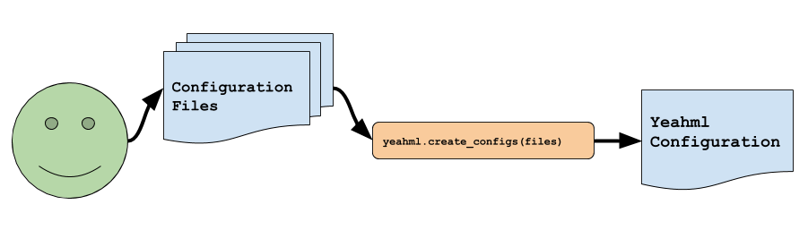
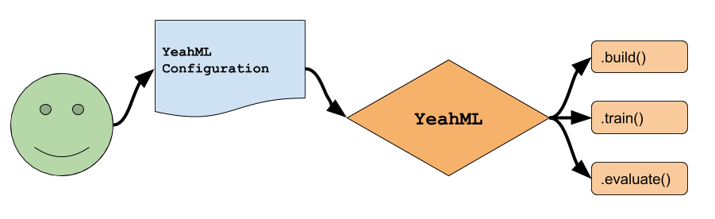

# YeahML

YeahML is a prototype framework for creating ML models using configuration files
(yaml or json).

Please note: 
- This is a personal project and is a work in progress and may change
  dramatically
- I would appreciate help developing+thinking through this project. If you are
  interested, please reach out via an issue or PR
- The current implementation is unbearably slow (roughly ~40+% slower on a
  supervised mnist classification example), but presently I'm focused on
  cleaning up the base to be more readable/correct.

## Overview

The core implementation is as follows:

1. Write+validate configuration file(s)



2. Build, train, and evaluate models/data according to the configuration




### Example in code

```python
import yeahml as yml

######################################################
# create+validate configuration file
yml_config = yml.create_configs("./main_config.yml")

######################################################
# build a model according to the config
model = yml.build_model(yml_config)


######################################################
# train the created model, where `train_dict` contains 
# information about the training dynamics
train_dict = yml.train_model(model, yml_config)

# note: if you can also pass an already created tf_dataset
# e.g.
# train_dict = yml.train_model(model, yml_config, ds_dict)
# where ds_dict contains may look like:
# ds_dict = {
#   "ds_name":{
#     "train": <tf.dataset>, 
#     "val": <tf.dataset>, 
#     "test": <tf.dataset>
#     }
#   }

######################################################
# evaluate graph -- can specify parameters to use, or will load the 
# "best params" (as defined by the user) created during training.
# where `eval_dict` contains information about the performance on the test dataset
eval_dict = yml.eval_model(
    model,
    yml_dict,
    dataset=ds_dict["test"]
)

```

## [Examples](./examples)

Examples are a work in progress


## Configuration Files

The configuration files can either be written in json or yaml (hence the project
name..) and may look something like the following. Eventually, the documentation
will display all of the available options.

<!-- Where documentation+examples for the main configuration file can be found [here](./docs/configuration_files/model_cdict.md) and documentation+examples for the main hidden layer architecture configuration file can be found [here](./docs/configuration_files/hidden_config.md). -->

The main config may look similar to the following. Where each of the main
headings can either be defined in the main configuration file or may be specified
as a path to another configuration file (such as the example case below where
the model is defined in another location). These indicated heading are required:
- meta
  - defines organizational information (project name etc)
- logging
  - defines how and where to log tf/yeahml information
- performance
  - defines the metrics/loss information for training/evaluating the model
- data
  - defines the connection from raw data --> model (may change significantly)
- optimize
  - defines _how_ to train the model
- hyper_parameters
  - catch-all for adjusting training information like batch_size.. however,
    these will should be moved to their corresponding locations. for example,
    batch size likely belongs with the dataset.
- model
  - defines how the model should be built and connected.  All tf.keras layers
    are available by their name.

```yaml
meta:
  data_name: 'abalone'
  experiment_name: 'trial_00'

logging:
  console:
    level: 'info'
    format_str: null
  file:
    level: 'ERROR'
    format_str: null
  graph_spec: True

performance:
  objectives:
    main:
      loss: 
        type: 'MSE'
      metric:
        type: ["MeanSquaredError", "MeanAbsoluteError"]
        options: [null, 
                  null]
      in_config:
        type: "supervised"
        options:
          prediction: "dense_out"
          target: "target_v"
        dataset: 'abalone'

data:
  in:
    features:
      shape: [2,1]
      dtype: 'float64'
    target_v:
      shape: [1]
      dtype: 'int32'

optimize:
  # NOTE: multiple losses by the same optimizer, are currently only modeled
  # jointly, if we wish to model the losses separately (sequentially or
  # alternating), then we would want to use a second optimizer
  optimizers:
    "main_opt":
      type: 'adam'
      options:
        learning_rate: 0.0001
        beta_1: 0.91 
      objectives: ["main"]
  directive:
    instructions: "main_opt"

hyper_parameters:
  epochs: 30
  dataset:
    # TODO: I would like to make this logic more abstract
    # I think the only options that should be applied here are "batch" and "shuffle"
    batch: 16
    shuffle_buffer: 128 # this should be grouped with batchsize
  
model:
  path: './model_config.yml'
```

A basic model config (where the path to this file is specified above by (`model:path`) may look similar to the following:

```yaml
meta:
  name: "model_a"
  name_override: True
  activation:
    type: 'elu' # defines default information

layers:
  dense_1:
    type: 'dense' # all tf.keras.layers are available
    options: # kwargs to the tf.keras.layers.___
      units: 16
    in_name: 'features' # defines the connection
  dense_2:
    type: 'dense'
    options:
      units: 8
  dense_out:
    type: 'dense'
    options:
      units: 1
      activation:
        type: 'linear' # all tf activation functions are available
```

### TensorBoard

After training, [tensorboard](https://www.tensorflow.org/tensorboard) can be
used to inspect the graph and metrics by issuing the following command:
`tensorboard --logdir "tf_logs/"` which will open tensorboard and display
figures similar to those below.

### Logging

Logging, if enabled, will produce the following log files:

- `build.log`
  - Contains information about building the graph. [Information + Example](./docs/logs/build.md)
- `eval.log`
  - Contains information about evaluating the graph [Information + Example](./docs/logs/eval.md)
- `graph.log`
  - Contains human readable, basic, information about the graph [Information + Example](./docs/logs/graph.md)
- `preds.log`
  - Contains logs of each evaluation set (label, predicted, ground truth, confidence) [Information + Example](./docs/logs/preds.md)
- `train.log`
  - Contains information about training the graph [Information + Example](./docs/logs/train.md)


## Motivation

The primary motivation is to define and create models easily. The *real* purpose
for this framework, in addition to developing+training models more easily, is to
act as a foundation for a separate project that will attempt to generate/analyze
architectures (AutoML) -- by allowing for config based model and training
definitions, performing multi/meta-learning becomes a lot easier.